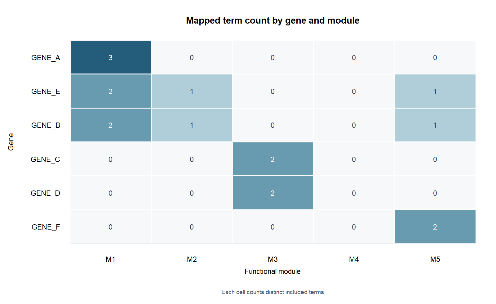

# Functional Module Evidence Mapping

A reusable workflow for turning a reviewed term-to-module mapping into traceable gene annotations, heatmap matrices, and Cytoscape-ready node attributes. The bundled `GENE_A`–`GENE_F` data are synthetic demonstrations.

```text
node list + enrichment tables + reviewed term/module dictionary
    -> gene–term–module evidence
    -> gene annotation and display decisions
    -> heatmap matrices and optional figure
    -> Cytoscape node and color tables
```

This workflow does not discover biological modules, apply enrichment significance thresholds, create Cytoscape networks, or control the Cytoscape application. A researcher must review the term mapping and any manual display overrides for each real dataset.



Preview: each cell is the number of distinct included terms mapped to that gene and module. Generated from the bundled PPI/STRING example by `src/plot_gene_module_heatmap.R`, using the matrix produced by `run_pipeline.py` and `config.example.json`. These labels and values are synthetic.

## Run the examples

Use Python 3.10 or newer. Install `requirements.txt` with your normal Python environment. Rscript is optional and uses base R only.

From this directory:

```powershell
python -m pip install -r requirements.txt
python run_pipeline.py --outdir results/ppi_example
python run_pipeline.py --enrichment-source custom --outdir results/custom_example
```

If Rscript is not on `PATH`, provide its executable path to generate PDF and PNG heatmaps:

```powershell
python run_pipeline.py --rscript "C:\Program Files\R\R-4.5.1\bin\Rscript.exe" --outdir results/ppi_with_heatmap
```

The output directory must be empty. Use a new directory for each run so old figures or tables cannot be mistaken for current results. Without Rscript, the workflow completes the CSV steps and records the heatmap step as skipped.

## Configure a project

Copy `config.example.json` outside the bundled example before changing it. Paths in a config file resolve relative to that file's directory; absolute paths also work. Run with:

```powershell
python run_pipeline.py --config path/to/project.json --outdir path/to/new_result
```

The required inputs are:

| Input | Required fields or files |
| --- | --- |
| Node table | A `Gene` or equivalent node identifier column |
| `ppi_string` enrichment | `enrichment.Process.tsv`, `enrichment.KEGG.tsv`, `enrichment.RCTM.tsv`, and `enrichment.WikiPathways.tsv` |
| `custom` enrichment | One or more CSV/TSV/Excel files with a term description and matching genes column |
| Module dictionary | Unique `Module_ID`; display name, six-digit hex color, and order are recommended |
| Term-to-module mapping | `term_description`, `Module_ID`, and optional `include`, reason, and confidence |
| Manual curation | Optional gene-level primary display module and explanation fields |

For enrichment files, `matching_genes` may separate identifiers with commas, semicolons, or vertical bars. A term is used only when its description exactly matches an included row in the term-to-module mapping. The unmatched-term report makes omissions visible. Gene identifiers are normalized to uppercase for matching.

Manual curation can change the primary displayed module and node styling; it does not remove the original gene–term–module evidence. `Core_gene` is a display heuristic based on the number of mapped terms/modules or a manual assignment, not a scientific validation label. See [input schema](docs/input-schema.md) before using real data.

## Outputs and traceability

| Directory | Main outputs |
| --- | --- |
| `01_annotation_evidence` | Long evidence table, unmatched terms, genes outside the node table, final gene annotation, preliminary matrices |
| `02_final_heatmap_matrices` | Binary and frequency matrices, gene order |
| `03_heatmap_figures` | Base R PDF and PNG when Rscript runs |
| `04_cytoscape_import` | Node import table and module/color lookup |
| `05_reference_tables_used` | Exact mapping, dictionary, curation, and input manifest used |
| `06_run_metadata` | Step metadata, SHA-256 input/output manifests, run status, Python/pandas and Git state |

The pipeline records a UTC timestamp, selected settings, input checksums, environment details, and whether optional steps ran. No random sampling is used. The generated `results/` directory is ignored by Git; inspect outputs before sharing them.

The Cytoscape table uses `Gene` as the join key. Import `cytoscape_node_import.csv` into a network with matching node identifiers, then map `Primary_fill_color_hex`, `Label_all_center`, `Node_size_main_px`, `Border_width_px`, and `Label_font_size_px` to the corresponding Cytoscape style properties. The exporter can also run on an existing final annotation table:

```powershell
python src/build_cytoscape_import.py --classification-table path/to/gene_module_classification_total.csv --output-dir path/to/cytoscape_tables
```

## Current validation scope

The two bundled input modes are checked by integration tests and by running the pipeline on the synthetic examples. Heatmap generation is checked separately when Rscript is available. These checks establish software behavior on the examples; they do not validate real biological interpretations or a Cytoscape network layout.
